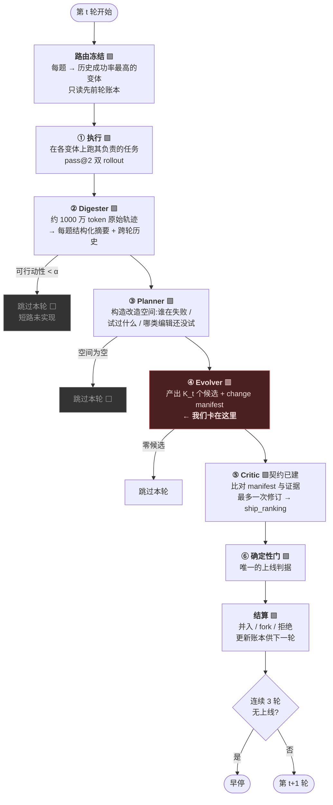
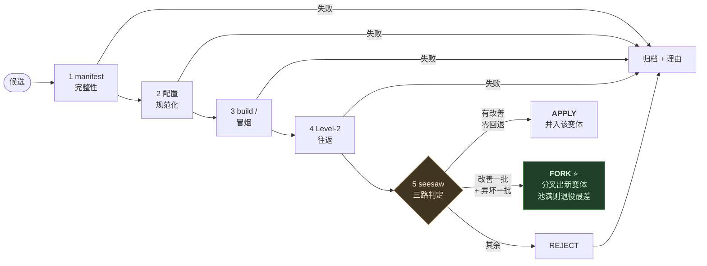
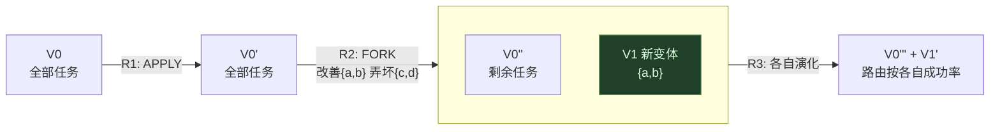

# AEGIS + 变体池:我们在建的架构

> 论文 HarnessX(arXiv 2606.14249)§4.3–§4.5 的机制,以及我方实现的当前状态。
> 图例:🟩 已建成并通过测试 · 🟥 卡住 · ⬜ 未实现

---

## 1. 一轮的完整流程

**四阶段(②③④⑤)全部由同一个 meta-agent LLM 驱动**,前三个可以自行短路(证据不足就跳过本轮),Critic 和门则是强制的——任何候选都必须过。

---

## 2. 门的内部:五关 + 三路判定

**首关失败即中止,拒绝的候选必须归档理由。** 第 5 关是论文最锋利的一步:**把"冲突"从拒绝理由变成分叉理由**——改善和弄坏不再二选一,而是分家各自留存。

其中第 2、3 关经查证与 `meta_agent.evolve` 内部的门重复(论文的门其实藏在那里),我方标注为 no-op-by-design。

---

## 3. 变体池的状态演进

关键:**K=1 时池里只有一个变体,永不 fork,退化成单谱系 = 论文的 Global 对照臂**;K>1 才是 Ensemble 臂。同一套代码、同样数据,只差变体数——这是最干净的对照。

---

## 4. 我们的实现状态

| 环节 | 状态 | 说明 |
|---|---|---|
| 路由冻结 | 🟩 | 只读先前轮账本,代码结构保证不会"用本轮结果反向路由" |
| pass@2 执行 | 🟩 | 论文附录 A.3 的无偏估计量 |
| Digester / Planner | 🟩 | 复用 repo 的近似实现 |
| **Evolver 产候选** | 🟥 | **meta-agent 分析完不写 config.yaml,候选恒为 0** |
| Critic 契约 | 🟩 | 已建,但没候选可排序 |
| 五关门 + 三路 fork | 🟩 | 全部测试通过,**但从没收到过候选** |
| 变体池 / 账本 / 退役 | 🟩 | 491 测试通过 |
| 早停 | 🟩 | idle ≥ 3 |
| 可行动性短路 | ⬜ | 论文有,我方未实现 |
| round-global 目标选择 | ⬜ | 论文未给算法,我方未实现 |

**结论:整条链只有一处断点——第 ④ 步的候选产出。** 它下游的所有机制(Critic、门、fork、变体池)都建好且测试通过,但因为收不到候选而空转。

---

## 5. 断点的性质

meta-agent(DeepSeek V4-pro)在 evolve 时会:读证据 → 分析失败 → 写出新模板 → **自查泛化性**(它甚至会检查"我有没有把具体答案写死进模板")→ 然后 **end_turn,不写最终的 `config.yaml`**。

repo 自己的诊断早就预见到这个模式:

> "meta-agent finished after Ns but no config.yaml was written. **This usually means it ended with analysis but did not commit to a final decision.**"

而且 repo 的原始指令里**已经写了**"不要只分析,必须写 config.yaml 或显式 cp 一份 no-op"——我方重复强调这句已被证明无效。

**所以这不是能力问题,是收尾动作缺失**:活干完了,最后一次文件写入没执行。论文用 Opus 4.6 少见这种情况;开源权重模型作 meta-agent,论文 §7.7 明说"未测"。

---

## 6. 论文 vs 开源 repo(必须记住的落差)

| | 论文 | 开源 repo |
|---|---|---|
| 四阶段 AEGIS | 有(Digester/Planner/Evolver/Critic) | **无**,只有单体 meta-agent |
| 每轮候选数 | K_t = 4 | **1** |
| change manifest | Table 9 完整 schema | **无**,用自己的 journal 格式 |
| 变体池 | §4.5 完整机制 | **零实现** |
| pass@2 | 评测标准 | **未实现** |

我方做的是"按论文附录重建",而重建中最脆的一环——让 meta-agent 稳定产出候选——正是当前的断点。
