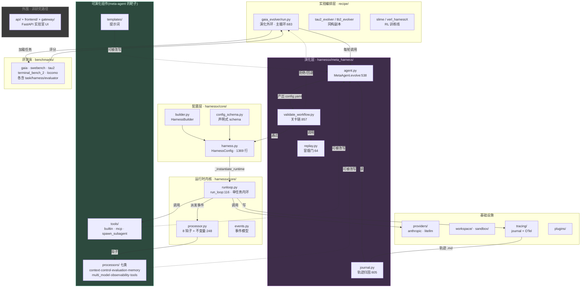
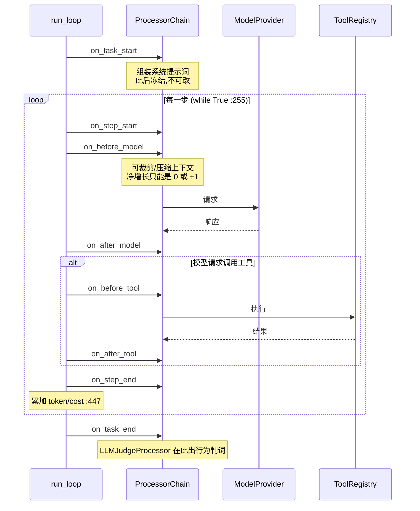
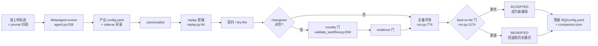
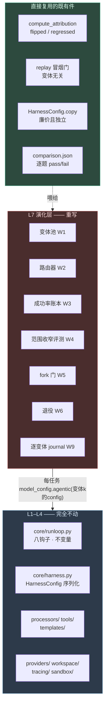
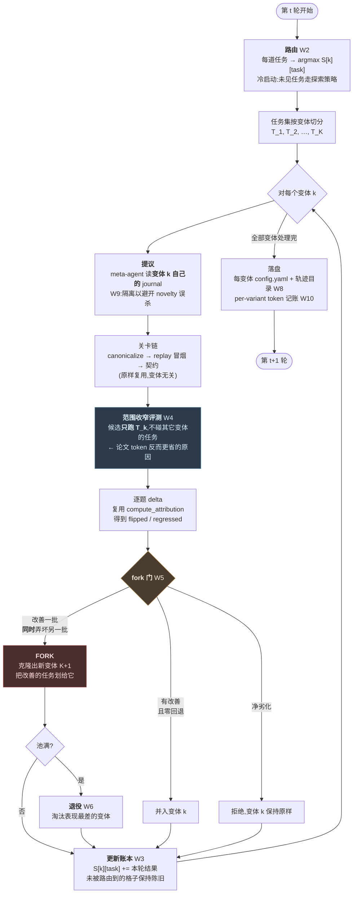

# HarnessX 架构解剖

> 依据:本地仓 `D:\PycharmProj\HarnessX`(fork of Darwin-Agent/HarnessX,MIT)逐文件亲读。所有判断带 `文件:行号`。
> 一句话:**这是一个"把 agent 运行时拆成声明式配置、再让另一个 agent 去改这份配置"的系统。** 架构的每个选择都服务于"可被机器安全修改"。

---

## 1. 全景

---

## 2. 五层职责

| 层 | 位置 | 职责 | 是演化靶子? |
|---|---|---|---|
| 实验编排 | `recipe/` | 跑多轮演化、门控、落盘、报表 | ✗ 外部脚手架 |
| 演化 | `harnessx/meta_harness/` | 读轨迹 → 提修改 → 过关卡 → 交付新 config | ✗ 演化的主体 |
| 配置 | `harnessx/core/harness.py` 等 | 声明式描述"一个 agent 长什么样",可 YAML 往返 | **✓ 这就是被改的东西** |
| 运行时内核 | `core/runloop.py` `core/processor.py` | 执行 agent 循环、派发事件、跑钩子链、守不变量 | ✗ 稳定底座 |
| 可演化组件 | `processors/` `tools/` `templates/` | 具体行为单元 | **✓ 主要靶子** |

**关键设计**:内核稳定、组件可换。meta-agent 永远不改 `runloop.py`,只改「装配清单」——这是整个系统敢让 LLM 自动改自己的前提。

---

## 3. 内环:一道任务的生命周期

`run_loop`(`runloop.py:116`)是单任务执行器,**注意别和演化外环混淆**。

**8 个钩子**(`processor.py:718-746`):`on_task_start` / `on_step_start` / `on_before_model` / `on_after_model` / `on_before_tool` / `on_after_tool` / `on_step_end` / `on_task_end`。

**退出原因**(`exit_reason`):`done` / `budget_exceeded` / `loop_detected` / `interrupted` / `error`。这些是失败模式的一级分类,meta-agent 据此定位该改什么。

### 双轨历史 —— 最精巧的一处设计

系统同时维护 **raw_track**(真实发生了什么)和 **effective_track**(模型实际看到什么)。processor 可以压缩、裁剪、重写 effective_track,而 raw_track 保持完整。

意义:上下文工程(压缩、摘要、窗口)可以自由演化,而轨迹记录和归因始终基于未被污染的原始历史。没有这个分离,meta-agent 就会读到被自己改过的历史,形成反馈污染。

---

## 4. 钩子链的不变量 —— 让 LLM 改配置不至于炸掉

`processor.py:248-343` 在**整条钩子链跑完后**统一校验:

| # | 不变量 | 防的是什么 |
|---|---|---|
| 1 | system 消息至多 1 条且必须在位置 0 | 提示词注入把结构搞乱 |
| 2 | `len(raw_track) == len(effective_track)` | 双轨错位 |
| 3 | 同下标 role 必须一致 | 双轨语义漂移 |
| 4 | 同下标 `tool_call_id` 一致 | 工具调用配对断裂 |
| 5 | `on_before_model` 净增长只能是 0 或 +1 | 上下文处理器偷偷塞消息 |
| 6 | 非授权钩子净增长必须为 0 | 越权修改历史 |

这是架构上对"可演化性"最直接的承载:**允许 meta-agent 随便加 processor,但用结构性断言兜住它能造成的破坏半径。**

---

## 5. 外环:一轮演化的生命周期

**关卡链分两段**(`validate_workflow.py:857-870`):
- **build 段**(canonicalize / replay 冒烟 / 契约):只验"这个 config 能不能启动",与内容无关;
- **policy 段**(novelty / evidence):只在有结构性改动时才跑,验"这个修改是不是重复了已被否决的假设"、"有没有证据支撑"。

**门的判据是聚合通过率**,不是逐题——这正是论文 Global 臂灾难性遗忘的机制根源,也是我们要改的地方。

---

## 6. meta-agent 到底能改什么

`HarnessConfig` 能完整 YAML 往返(`to_yaml_file` / `from_yaml_file` / `canonicalize`),所以「一个 agent」= 一个 YAML 文件 + 几个 sidecar 目录。可改的四类:

| 类别 | 内容 | 典型修改 |
|---|---|---|
| **processors**(7 类) | context(提示词/包装)、control(**13 个**:成本护栏/循环检测/token 预算/压缩/工具纠错/谄媚检测…)、evaluation(裁判/PRM)、memory(写入与召回)、multi_model(运行时模型路由)、observability(检查点/OTel/指标)、tools(技能装载/工具过滤) | 加一个循环检测器、改压缩策略 |
| **tools** | web_search / web_fetch / browser / read / write / edit / glob / grep / bash;另有 MCP 接入、代码执行、子 agent 派生 | 新写一个专用取数工具 |
| **templates** | 提示词模板(.j2) | 重写系统提示词 |
| **config 标量** | 步数上限、成本上限、预算比例等 | 调 max_steps |

论文 p.16 提到的 lever 分层(prompt → processor → tool → metric)就对应这张表,而"从提示词级修改转向工具级修改"正是它记录的一次关键跃迁。

### 关键:meta-agent 能写新的 Python 文件

这是可演化性的地基,不只是"改参数"那么简单:

- evolve 的交付物是 `config.yaml` **加上** `tools/<name>.py`、`processors/<name>.py`、`templates/<name>.j2`(`agent.py:746-750`);
- `_target_` 支持 `file:///abs/path.py::symbol` 形式(`agent.py:291-293`),**新写的文件无需注册进框架即可被 config 引用**;
- 框架专门为此做了容错:processor 崩溃隔离(`processor.py:686-714`)的注释明写目的是给"generated meta-skill processors whose runtime bugs escape smoke_load"兜底。

**meta-agent 自己也是一个跑在同一个 `run_loop` 上的普通 agent**(`agent.py:606-626`),并被 WriteScopeGate / ReadScopeGate / LeakageGuard 三个 processor 限制写入边界和"不许看源码与答案"(`agent.py:196-242`)。演化层没有第二套执行引擎——架构上很干净的一点。

---

## 7. 基础设施要点

**provider 层的硬约束**:`litellm_provider.py:92-98` 直接拒绝 Claude 模型,理由是 LiteLLM 无法可靠往返带签名的 thinking 块,会同时破坏 API 正确性和前缀缓存。Claude 必须走 `anthropic_provider.py`。
⚠️ 但守卫只匹配 `claude-` / `anthropic/` 前缀,`openrouter/anthropic/claude-*` 会静默绕过。

**工具的外部依赖**:`web_search` 优先 SerpAPI(`SERPAPI_API_KEY`)或 Tavily(`TAVILY_API_KEY`),两者缺失时降级到 DuckDuckGo(免密钥)。

**tracing 是演化的输入源**:`tracing/journal.py` 生成的轨迹 `.md` 是 meta-agent 唯一的观察窗口。设计上刻意**不写入标准答案**,只写 `eval_passed` / `eval_score`——meta-agent 能看到"错了",看不到"正确答案是什么",避免它针对答案作弊。

**未走通的分支**:`rl/`、`recipe/slime`、`recipe/verl_harnessX` 是 RL 训练线;`api/` + `frontend/` + `gateway/` 是实验室 Web UI。README 的 8 项勾选里只有 3 项是真代码(Light-Memory / Slime RL / MetaHarness),BO 优化、HarnessHUB、多模态记忆、RL 飞轮均为零代码 roadmap。

---

## 8. 对我们加变体池的摩擦点

| 摩擦 | 位置 | 影响 |
|---|---|---|
| 演化环内联在 `main()`,且有 **4 份带漂移的副本** | `gaia_evolver/run.py:1174` + 同 recipe 内 `run_meta.py:403` 第二份门;`tau2_evolver/run.py:1164` 用 **4 元组 + avg_reward** 计分;`tb2_evolver` 有 evolve **但无门** | 抽引擎的必要性更高;但反过来说 **M1 只改 gaia 一条线即可**,不必同步四份 |
| 单 `current_config` + 单 `best_so_far` | `run.py:633,672` | 状态模型天然单谱系 |
| 门以聚合通过率判定 | `run.py:1174` | 变体池要的是逐题分支(改善/回退混合 → fork),语义不同必须重写 |
| novelty 门读全局 journal | `validate_workflow.py:694` | **会误杀 fork 出的兄弟变体**——同簇同 lever 的合法重试被判为"重提已否决假设",必须按变体隔离 journal |
| evolver 每轮只产一个 config | `agent.py:646` | 论文的 per-candidate fork 需要一轮多候选,忠实实现要重构 |
| tracer 每轮单一 | `run.py:697` | 多变体需各自独立轨迹目录 |

**可直接复用的**:config 序列化与拷贝(`harness.py:929`,拷贝廉价且独立)、逐题 pass/fail 管道(`comparison.json`)、`compute_attribution` 的 flipped/regressed 分类(`journal.py:605`,正好等于论文的 fork 触发判据)、replay 冒烟门(变体无关)、per-task token 记账。
**机制级确认**:每任务各自 `_instantiate_runtime`(`harness.py:999`),所以 K 变体并发**无新增共享态风险**,也不增加实例化开销。

---

## 9. ⚠️ 成本数字不可信 —— 影响范围的精确界定

`_estimate_cost`(`runloop.py:947-949`)**硬编码 Claude Sonnet 价格**($3/M 输入、$15/M 输出),在 `:452` 被无条件调用,没有任何"用 provider 上报真实成本"的分支。

用 DeepSeek V4 flash($0.14/$0.28)跑时,报告成本约为真实成本的 **27 倍**。逐项影响:

| 受影响处 | 是否真的坏了 | 说明 |
|---|---|---|
| `record["cost_usd"]` 与 `round_cost` | ❌ **坏了** | 跨模型系统性失真。**任何成本核算必须改用 `total_tokens` 自行计价** |
| CostGuardProcessor | ⚠️ 名不副实但行为一致 | 因为价格是常数,它实际上是个**伪装成美元上限的 token 上限**:`--max-cost 2.0` ≈ 476k tokens。与论文锚点 46.5k/次相比有 10 倍余量,通常不会截断 |
| best-so-far 门的 `cost_weight` | ✅ **不受影响** | 门用的是**相对**比值 `(round_cost − best_cost) / best_cost`(`run.py:1219`),常数倍率在分子分母同时出现、**直接约掉**。同模型下排序不变 |

**给我们的操作结论**:成本校准阶段读 `total_tokens` 而非 `cost_usd`;`--max-cost` 当 token 预算理解并按 27 倍放宽(或直接改 `_estimate_cost` 接 litellm 真实价格,约十行)。

---

## 10. 目标架构:加上变体池之后

### 10.1 改动只落在最外一层

这是整个工程可行性的关键——**运行时内核、配置层、processor、tools、provider 全部原样不动**,变体池只重写演化编排。

### 10.2 变体池演化环:一轮的完整流程

### 10.3 与现状的核心差异

| | 现状(单谱系 = 论文 Global 臂) | 目标(变体池 = 论文 Ensemble 臂) |
|---|---|---|
| 状态 | 一个 `current_config` + 一个 `best_so_far` | K 个变体,各带 config / journal / 任务归属 |
| 评测范围 | 每轮全部任务跑在同一个 config 上 | 候选只跑它负责的任务子集 |
| 门的判据 | **聚合**通过率对历史最优 | **逐题** delta 分三路:并入 / fork / 拒绝 |
| 冲突处理 | 回退(丢掉改善的部分) | fork(改善与回退**分家**,各自留存) |
| journal | 全局一份 | 每变体一份(否则 novelty 门误杀兄弟变体) |
| 失败模式 | 修一批坏一批 → 灾难性遗忘 | 修的留在原变体,坏的隔离到新变体 |

### 10.4 论文留白、必须我们自己设计的部分

图里这几个框,论文只有一句话或干脆没写,是 M1 的实际科研内容:

| 组件 | 论文写了什么 | 我们要定什么 |
|---|---|---|
| 成功率估计 W3 | "highest estimated success rate … across prior rounds" | 裸频率还是平滑?全历史还是窗口?陈旧格子怎么处理? |
| 冷启动 W2 | 无 | 第 0 轮怎么分?新 fork 的变体继承哪些成绩? |
| 探索策略 W2 | 无 | 纯 argmax 会让失手一次的变体永不翻身,要不要 ε-greedy? |
| fork 继承 W5 | "fork 出新变体" | 新变体带走哪些任务、继承哪些历史? |
| 退役指标 W6 | "retiring the lowest-performing variant" | 按什么指标、在哪个任务集上算? |
| 簇粒度 W7 | §4.5 说按簇,6.3 复述时"簇"字消失 | per-task?按 GAIA level?学习聚类? |

**这正是 M1 的贡献所在**:不是复现别人写好的机制,而是补完他们没写的设计,并给出带消融的方案。

详见 `HARNESSX-IMPL-CHECKLIST.md` 的 W1–W12 施工表。
