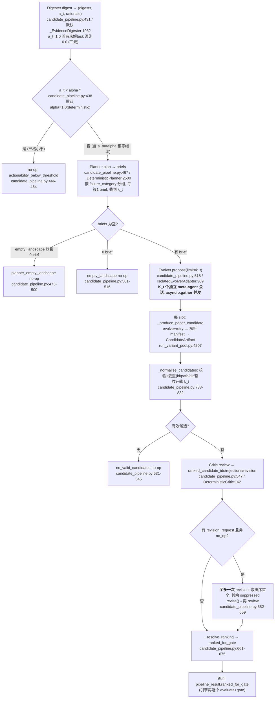
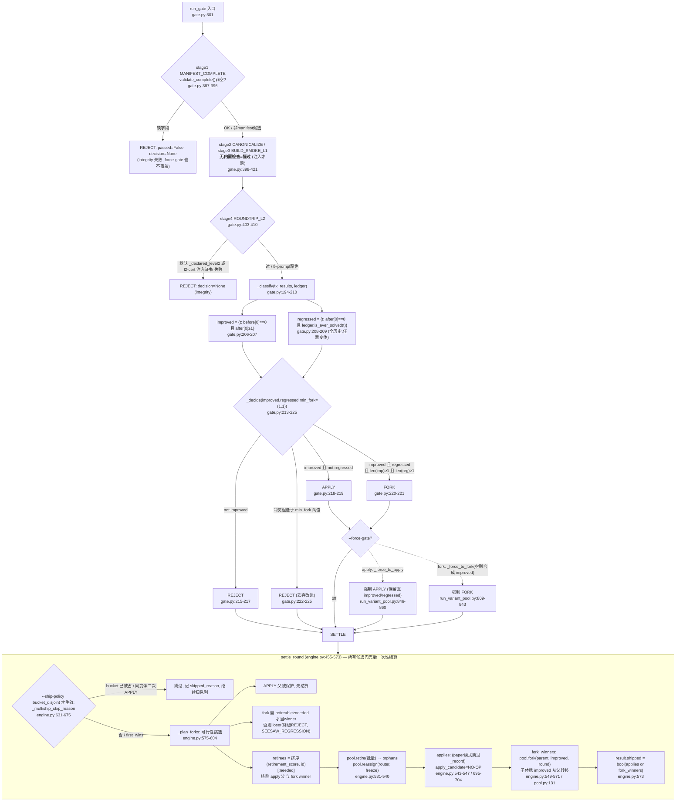

# FLOW-IMPL — 代码反推的实际执行流程（B 侧 / 双盲实现侧）

> 本文件**只依据 `.py` 代码与测试**反推。零论文知识：不描述"论文怎么规定"，只描述"代码实际做什么"。
> 内联注释在代码里无法回避，可读，但凡注释声称与可执行语义冲突处，一律以代码为准并标注 `[注释与代码不符]` 或 `[注释自承与名字不符]`。
> 主入口：`recipe/gaia_evolver/run_variant_pool.py`。引擎：`experiments/variant_pool/engine.py`。同目录 `gate/critic/candidate_pipeline/router/reporting/pool/ledger/manifest/evidence/target`。

---

## 0. 一句话总览

`main()` 冻结 H0→V0，建 pool(K=1)/ledger/router/engine，然后跑 `num_rounds` 轮。**paper 模式（默认）下**每轮做两件互相独立的评测：
1. **候选门评测**（只在被选中的 target 变体的 `T_k` 上，给 K_t 个候选逐个跑真 rollout → 五关门 → APPLY/FORK/REJECT）；
2. **结算后全量评测**（`_score_active_portfolio`，对结算后部署的整个池在**全task集**上再跑一次真 rollout），**只有后者写 ledger**，供下一轮 routing/gate 使用。

R0 是纯基线：**不进引擎**，只做全量评测并写 ledger，演化从 R1 起。

---

## 1. 总流程图（轮级 · 默认 paper 路径为主干 · 旗标分支虚线并标旗标名）

```mermaid
flowchart TD
    %% ---------- bootstrap ----------
    M0["main() 解析+校验参数<br/>run_variant_pool.py:6438-6454<br/>pass_k≥1/pool_k≥1/patience≥1/拒占位provider"]
    M1["setup(): 冻结 H0 → V0/config.yaml<br/>run_variant_pool.py:6393-6417<br/>make_gaia_builder_gpt5().build()+可选judge"]
    M2["build meta-agent VariantPoolMetaAgent<br/>run_variant_pool.py:6419-6426<br/>extended_thinking, budget 32k/40k"]
    M3["_build_experiment_lock + lock.save<br/>run_variant_pool.py:6481-6516"]
    M4["Recipe.__init__: pool.add_root(V0 携带全部task)<br/>ledger/router/engine 装配<br/>run_variant_pool.py:3748-3791"]
    M0 --> M1 --> M2 --> M3 --> M4 --> R0Q

    RES["--resume: plan_resume→load_resume_state<br/>apply_resume_state, start_round=next<br/>run_variant_pool.py:6460/6530-6532"]
    M0 -.->|"#45;#45;resume"| RES -.-> R0Q

    %% ---------- round loop ----------
    R0Q{"paper 且 round_idx==0 ?<br/>run_variant_pool.py:3823"}
    R0Q -->|"是 (R0)"| B0["R0=纯基线: 不进引擎<br/>RoundResult(idle=engine.idle)<br/>run_variant_pool.py:3828-3833"]
    R0Q -->|"否 (R≥1)"| SEL

    SEL["select_target_variant(worst_first)<br/>eligible=_variants_with_settled_trajectories<br/>run_variant_pool.py:3836-3842 / target.py:37,87"]
    SEL --> ER["engine.run_round(round_idx, all_ids)<br/>engine.py:273"]

    subgraph ENG["engine.run_round — 一轮引擎 (engine.py:273-449)"]
        F1["1 freeze_routing: 只读 round<round_idx<br/>ledger 已含本轮则 RoutingFreezeError<br/>router.py:167-197 / engine.py:278"]
        F2["2 pool.apply_routing(frozen)<br/>engine.py:281 / pool.py:275"]
        F3{"逐个 freeze 期变体<br/>T_k 空→跳过<br/>engine.py:297-300"}
        F4["evolve(variant)=_run_paper_candidate_pipeline<br/>engine.py:303 → run_variant_pool.py:4116"]
        F5["_candidate_queue: 截到 max_candidates_per_variant<br/>engine.py:304 (=candidates_per_round)"]
        F6{"逐个 ranked 候选<br/>engine.py:329"}
        F7["evaluate(): 真 pass@k rollout on T_k<br/>engine.py:332 → run_variant_pool.py:4569/4634"]
        F8["_task_eval: before=(2,2)若ledger passes≥1 否则(0,2)<br/>engine.py:812-824"]
        F9["gate(candidate,cfg,ledger,tk_results)<br/>engine.py:345 → 五关门"]
        F10{"decision?"}
        F11["APPLY/FORK → pending;<br/>claimed_buckets/applied_variants 记账<br/>engine.py:364-400"]
        F12["REJECT → 归档, 试下一个 ranked<br/>engine.py:421-430"]
        SETTLE["_settle_round: plan_forks→退役→reassign→apply/fork<br/>engine.py:443/455-573"]
        IDLE["idle = 0 if shipped else idle+1<br/>engine.py:446"]

        F1 --> F2 --> F3
        F3 -->|"有 T_k"| F4 --> F5 --> F6 --> F7 --> F8 --> F9 --> F10
        F10 -->|"APPLY/FORK"| F11
        F10 -->|"REJECT"| F12
        F11 -->|"first_wins: break"| SETTLE
        F11 -.->|"#45;#45;ship#45;policy bucket_disjoint: 继续扫"| F6
        F12 --> F6
        F3 -->|"全部完"| SETTLE --> IDLE
    end

    ER --> ENG
    IDLE --> RC["_reconcile: 推进各变体 config 血统<br/>APPLY→变体config=候选; FORK→子体=候选<br/>run_variant_pool.py:4761-4859"]
    B0 --> SCORE
    RC --> SCORE

    SCORE["_score_active_portfolio: 结算后<b>全task集</b>重评部署池<br/>candidate_reuse 或 fresh rollout<br/>run_variant_pool.py:4875-4972"]
    SCORE --> RECS{"paper 模式?"}
    RECS -->|"是"| WR["_record_settled_active_outcomes<br/><b>唯一写 ledger 处</b> (供下一轮)<br/>run_variant_pool.py:4974-5015"]
    RECS -->|"否(legacy)"| ING
    WR --> ING

    ING["_ingest_report + _dump_round<br/>run_variant_pool.py:5107 / 5352"]
    ING --> STOP{"非R0 且 idle≥patience?<br/>run_variant_pool.py:3852-3857"}
    STOP -->|"是"| FIN["_dump_final<br/>run_variant_pool.py:5478"]
    STOP -->|"否 且 还有轮"| R0Q
    STOP -->|"否 且 轮尽"| FIN

    %% ---------- flag-gated forks ----------
    FG["#45;#45;force#45;gate apply/fork:<br/>覆盖 stage5 决策(仅当stage1-4已过)<br/>run_variant_pool.py:751-806"]
    FG -.->|"#45;#45;force#45;gate"| F9
    L2["#45;#45;l2#45;cert auto: stage4 机器自证<br/>run_variant_pool.py:1263-1317"]
    L2 -.->|"repo+paper候选"| F9
    LEG["legacy_single: 每个活跃变体 evolve 一次(opaque)<br/>run_variant_pool.py:3939-3997"]
    LEG -.->|"#45;#45;candidate#45;mode legacy_single"| F4
```



### 候选生产子图（paper 管线内部，`CandidatePipeline.run`，candidate_pipeline.py:429-675）



---

## 2. 结算裁决子图（条件精确到代码不等式）

门的第 5 关（seesaw）与结算的分叉、退役、reassign。



### 关键裁决实值（default）

| 量 | 实值 | 位置 |
|---|---|---|
| `min_fork` | `(1, 1)` — 无 CLI 旗标，恒定 | engine.py:94 / gate.py:120 |
| APPLY 条件 | `improved 非空 且 regressed 空` | gate.py:218-219 |
| FORK 条件 | `improved 非空 且 regressed 非空 且 len≥(1,1)` | gate.py:220-221 |
| REJECT 条件 | `improved 空` **或** `冲突<min_fork` | gate.py:215-217, 222-225 |
| improved 基线 | 候选自身 `T_k` 的 before（(0,2) 才算可改进） | gate.py:206, engine.py:823 |
| regressed 基线 | `ledger.ever_solved`（全历史、任意变体、只增） | gate.py:208, ledger.py:265-267 |
| force-gate 边界 | 仅当 `real.decision is not None`（stage1-4 已过）才覆盖 | run_variant_pool.py:800 |
| ship 两模式 | `first_wins`=首个 APPLY/FORK 即 break；`bucket_disjoint`=每个未占 bucket 都 ship，同变体二次 APPLY 跳过 | engine.py:364-417, 631-675 |

---

## 3. 变体池与路由（face 3）

| 项 | 代码事实 | 位置 |
|---|---|---|
| 池上限 K | `VariantPool(K=args.pool_k)`，CLI 默认 **1**；`pool.py` 库默认 `DEFAULT_K=8` 但被 recipe 覆盖 | run_variant_pool.py:3748 / pool.py:60 |
| V0 冷启 | `add_root(..., tasks=all_ids)` → **V0 一开始携带全部 task** | run_variant_pool.py:3749 / pool.py:104-129 |
| fork 继承 | `improved_tasks` **从父转移到子**（`parent.routed_tasks -= improved`）；子体深拷贝 config/journal/owned-slots | pool.py:131-201（197 转移） |
| 退役度量 | `retirement_metric`（默认 `task_macro`=各 task 原始成功率的均值） | ledger.py:269-333 / defaults 见 __init__:3746 |
| 退役触发 | 仅在 `_plan_forks` 中池满且 fork 需腾位；退役者=排除 apply 父/fork winner 后按 `(retirement_score, id)` 最低者 | engine.py:575-604 |
| 不能退役 | 池只剩 1 个时 `retire` 抛错；K=1 的 fork 被引擎降级为 REJECT | pool.py:226-227 |
| 路由单元 | **逐 task** 路由，但证据在**簇**上聚合 | router.py:203-245 |
| 簇定义 | 注入 `task_to_cluster = {task: f"gaia_level_{level}"}`（GAIA 难度层），非 routing-induced | run_variant_pool.py:3742-3745 |
| 冻结用哪轮账本 | `freeze_routing(before_round=round_idx)` → 只读 `round_idx < round` 的 cell；ledger 只在结算后为**下一轮**写 | router.py:167-197 / ledger.py:225-251 |
| 估计量公式 | Laplace `(Σpass+1)/(Σatt+2)`，空 cell 先验 `0.5`；簇上**先聚合再一次 Laplace** | ledger.py:258-263, 170-196 |
| window | `--routing-window` 默认 `None`=全历史；给值则 `[ref-w, ref)` 逐轮桶 | ledger.py:225-251 |
| 冷启动 | 无先验证据→`cold_start`：单变体→V0；多变体→`variant_rollup` 最高者；平局最低 id | router.py:247-281 |
| 探索 | ε-greedy 默认关（`epsilon=0.0`，恒返回 None，不碰 ledger） | router.py:283-298 |
| 平局 tie-break | 默认 `fewest_attempts`（该簇尝试最少者，再 id） | router.py:326-348 |
| target 选择 | `worst_first`=`min(variant_rollup)`；限于 eligible（有已结算轨迹且有 routed task 的变体） | target.py:87-89 / run_variant_pool.py:3862-3902 |

**唯一写 ledger 的地方（paper 模式）**：`_record_settled_active_outcomes`（run_variant_pool.py:4986）。引擎 `_settle_round` 的 `_record` 被 `record_selected_results=False` 关掉（__init__:3789）。因此 routing/门的 before/ever_solved 全部来自**结算后全量评测**，不来自候选门评测。`[反直觉]`

---

## 4. 旗标矩阵（build_arg_parser 逐个，run_variant_pool.py:6017-6343）

> 默认关时行为 vs 开启时行为分列。`store_true` 者默认 False。

### 4.1 预算 / 数据 / 模型

| 旗标 | 默认 | 语义（一句话） |
|---|---|---|
| `--max-tasks` | `6` (MAX_TASKS) | 载入 task 数上限；≤0=全部。|
| `--max-cost` | `5.0` (MAX_COST_USD) | 每 task rollout 成本帽（也裁剪 replay 成本 `min(0.5, max_cost)`）。|
| `--num-rounds` | `15` (PAPER_NUM_ROUNDS) | 轮数上限。|
| `--model` | `DEFAULT_MODEL`（占位，运行时必须换真值） | 内层做题 agent 模型。|
| `--meta-model` | `DEFAULT_META_MODEL`（占位） | meta-agent（evolve）+ judge 模型。|
| `--provider-id` | env `HARNESSX_PROVIDER_ID` | 具体 provider id；占位串被拒。|
| `--api-base` / `--api-key` | `None` | `--model` 的 OpenAI 兼容端点/密钥。|
| `--clean` | `False` | 起跑前清空 `runs/<tag>/`。|
| `--no-judge` | `False` | 关 LLMJudgeProcessor。开=不加 judge 处理器。|
| `--evolve-cost` | `50.0` | meta-agent 每次 evolve 成本帽。|
| `--evolve-steps` | `200` | meta-agent evolve 步数帽。|
| `--evolve-wall-clock` | `10000` | meta-agent evolve 墙钟秒帽。|
| `--run-tag` | 时间戳 `pool_%Y%m%d-%H%M%S` | 输出目录标签。|
| `--resume` | `None` | 从最后已结算轮续跑；与 `--clean` 互斥；lock 不一致则拒绝续跑（无 --force）。|
| `--data-path` | `data/webthinker_gaia_dev.json` | 本地 GAIA JSON；`''`=HF 下载。|
| `--attachments-dir` | `None` | 每 task 附件目录。|
| `--level` | `0` | GAIA 层筛选；0=全部。|
| `--max-steps` | `20` (MAX_STEPS) | 每 task 步数帽（覆盖 task 默认）。|

### 4.2 评测 / routing / 池

| 旗标 | 默认 | 关时 vs 开时 |
|---|---|---|
| `--concurrency` | `10` (PAPER_CONCURRENCY) | 每轮并发轨迹上限（`asyncio.Semaphore`）。|
| `--pass-k` | `2` (PAPER_PASS_K) | 每 task 每轮独立 rollout 次数；outcome=(n_pass,n_att)。|
| `--patience` | `3` (PAPER_PATIENCE) | idle≥patience 提前停。|
| `--seed` | `0` | routing RNG 种子（仅 ε/random tie-break 用）。|
| `--planned-seeds` | `(0,1,2)` | 实验计划血统种子（非本 run 的 --seed；仅记进 lock）。|
| `--estimator` | `laplace` | `laplace`=Laplace 平滑；`raw`=`Σpass/Σatt`。|
| `--cluster-mode` | `routed`（choices 只此一项） | 簇读法（此入口锁死 routed，实际簇由注入的 level map 决定）。|
| `--routing-mode` | `cluster` | `cluster`=按 GAIA-level 簇聚合证据；`task_tournament`=退回逐-task 单例证据。|
| `--routing-window` | `None` | 关=全历史估计；给值=滚动窗。|
| `--retirement-metric` | `task_macro` | 退役/冷启排名量：`task_macro`(各task均权) / `cluster_macro` / `raw`。|
| `--pool-k` | `1` | K=1=单血统(paper Global,永不 fork)；8=Ensemble。同一代码路径。|
| `--target-strategy` | `worst_first` | paper 模式选一个全局 target：`worst_first`/`round_robin`/`failure_density`；`all_active_variants` 仅 legacy。|

### 4.3 候选管线 / 门 / AEGIS 角色

| 旗标 | 默认 | 关时(默认)行为 vs 开时行为 |
|---|---|---|
| `--candidate-mode` | `paper` | `paper`=单一全局 target + 结构化 K_t 管线；`legacy_single`=每个活跃 routed 变体一个 opaque 候选（run_variant_pool.py:3939）。|
| `--candidates-per-round` | `1` | 全局 K_t 帽（1-4）。默认 1=repo 原生单候选。`[注:__init__ 的 getattr 兜底常量是 PAPER_CANDIDATES_PER_ROUND=4，但 CLI 默认 1，运行时永远是 1]`。开到 4 → **N 个独立 meta 会话**，成本×N。|
| `--manifest-mode` | `repo` | `repo`=manifest.yaml **可选**，缺失则从 journal/config-diff 适配，paper-only 字段标 gap 不捏造；`paper`=manifest.yaml **必需**且严格 Table-9。|
| `--force-gate` | `off` | `off`=门 byte-identical；`apply`/`fork`=**覆盖 stage-5 决策**（仅 stage1-4 已过时），结果被标注为"非测量"。|
| `--l2-cert` | `auto` | `auto`=stage4 对 repo 模式未申报的 tool-bucket 候选**机器自证**（真实工具输出过真序列化器）；processor-only 用 REPLAY.md 通过标记；`off`=只看申报(byte-identical)。仅 `repo`+`paper` 候选生效。|
| `--ship-policy` | `first_wins` | `first_wins`=首个 APPLY/FORK 即 ship 其余跳过；`bucket_disjoint`=每个未占 bucket 都 ship，同变体二次 APPLY 记为不可重构而跳过。|
| `--aegis-digester` | `deterministic` | `deterministic`=`_EvidenceDigester`(a_t 二元)；`llm`=每个 FAILED task 一次 meta 解释调用 + 一次 round a_t 调用。|
| `--aegis-planner` | `deterministic` | `deterministic`=按 failure-category 分簇出 brief；`llm`=一次 meta 调用建 mutation landscape，空则短路。|
| `--aegis-critic` | `deterministic` | `deterministic`=`DeterministicCritic` 组合审计；`llm`=一次 meta 调用排名/否决/≤1修订。|
| `--aegis-prompts` | `paper` | `paper`=用论文 App B.1 Planner/Evolver/Critic 文本驱动 LLM 角色；`ours`=OURS 重构文本(消融)。仅影响 llm 角色与恒-LLM 的 Evolver。|
| `--actionability-threshold` | `None`→auto | auto：deterministic 数字化为 `1.0`，llm 为 `0.5`；显式值总胜（run_variant_pool.py:306-321）。|
| `--evolve-retry` | `1` | meta slot 只出分析没 config.yaml 时，回喂 DECISION_REQUIRED 重试 N 次（1=允许一次修订）。|

### 4.4 其它工具/记账开关

| 旗标 | 默认 | 关 vs 开 |
|---|---|---|
| `--step-countdown` | `off` | 关=H0 byte-identical；开=给部署 config 追加 StepCountdownProcessor（候选继承），lock 记 provenance 警告。|
| `--search-backend` | `chain` | `chain`=内置 SerpAPI→Tavily→Wiki+Bing→DDG 链；`serper`=Serper 优先 drop-in，失败回退同链。|
| `--evolve-commit-bounce` | `off` | 关=无 config 立即失败(byte-identical)；开=先给同 slot 一次 ≤15 步"立刻决断"续跑再失败。|
| `--regression-accountability` | `strict` | `strict`=任何 active regression 都可触发整轮 no-op 否决；`shipped_only`=只有已 ship 的 APPLY/FORK 造成的 regression 硬否决，其余降级为非阻塞 strategy_concern。|

**旗标总数：47。** 其中 `store_true` 开关 2 个（`--clean`、`--no-judge`），其余为 `choices` 枚举或数值/字符串型。

---

## 5. 超参实值（defaults.py + 模块常量）

| 常量 | 值 | 位置 |
|---|---|---|
| `MAX_TASKS` | 6 | defaults.py:13 |
| `MAX_COST_USD` | 5.0 | defaults.py:14 |
| `MAX_STEPS` | 20 | defaults.py:15 |
| `DEFAULT_CONCURRENCY` | 4（但 CLI 用 PAPER_CONCURRENCY=10） | defaults.py:16 |
| `PASS_COUNT_NOISE_THRESHOLD` | 3 | defaults.py:23 |
| `NUM_ROUNDS`(defaults) | 3（但 CLI 用 PAPER_NUM_ROUNDS=15） | defaults.py:26 |
| `EVOLVE_COST_CAP_USD` | 50.0 | defaults.py:29 |
| `EVOLVE_MAX_STEPS` | 200 | defaults.py:30 |
| `EVOLVE_WALL_CLOCK_S` | 10000 | defaults.py:31 |
| `PAPER_NUM_ROUNDS` | 15 | run_variant_pool.py:195 |
| `PAPER_PASS_K` | 2 | run_variant_pool.py:196 |
| `PAPER_PATIENCE` | 3 | run_variant_pool.py:197 |
| `PAPER_CONCURRENCY` | 10 | run_variant_pool.py:198 |
| `PAPER_CANDIDATES_PER_ROUND` | 4（K_t 上限；CLI 默认 1） | run_variant_pool.py:200 |
| `DEFAULT_PATIENCE`(engine) | 3 | engine.py:90 |
| `DEFAULT_MIN_FORK` | (1,1) | engine.py:94 / gate.py:120 |
| `DEFAULT_MAX_CANDIDATES`(engine 防御) | 4 | engine.py:100 |
| `DEFAULT_K`(pool 库默认，被覆盖) | 8 | pool.py:60 |
| `DEFAULT_STALE_PRIOR` | 0.5 | ledger.py:53 |
| `OURS_DEFAULT_ACTIONABILITY_THRESHOLD` | 0.5 | candidate_pipeline.py:41 |
| `LEGACY_ACTIONABILITY_ASSUMPTION` | 1.0 | candidate_pipeline.py:46 |
| `DEFAULT_K_T` / `MAX_K_T` | 4 / 4 | candidate_pipeline.py:37-38 |
| `_BOUNCE_MAX_STEPS` | 15 | run_variant_pool.py:225 |
| `LEVER_BAN_WINDOW/MIN_SHIPS/HIT_RATE` | 3 / 2 / 0.4 | evidence.py:68-70 |
| meta thinking budget / max_tokens | 32000 / 40000 | run_variant_pool.py:6373-6374 |
| replay cost 裁剪 | `min(0.5, max_cost)` | run_variant_pool.py:3976, 4241 |

---

## 6. Manifest 契约（face 6，manifest.py `validate_complete`:344-395）

候选须携 `ChangeManifest`，门 stage-1 = `validate_complete()` 返回空列表。要求申报字段：

| 字段 | 要求 | 位置 |
|---|---|---|
| `candidate_id` | 非空且匹配 `^C-R\d+-\d{2,}$` | manifest.py:375-378, 82 |
| `bucket` | 非空，⊆ `(prompt,tools,config,processor)` | manifest.py:380-385, 63 |
| `capability_evidence` | code bucket(tools/processor)须≥1条，**除非 provenance=repo_journal**；每条 `{type,claim,evidence}`，type∈EVIDENCE_TYPES | manifest.py:397-419 |
| `file_changes` | **非空**，每条 `{path,action,diff_summary}`，action∈(create,modify,delete) | manifest.py:421-435 |
| `predicted_impact` | 至少 1 个 predicted flip(unlock+stabilize)；unlock∩stabilize 冲突禁；unlock∩at_risk 冲突禁 | manifest.py:437-455 |
| `attribution_signature` | 非 prompt-only 候选**必需**，**除非 repo_journal**；tool_call 需 tool_name；expected_min_calls≥1 | manifest.py:457-479 |
| `target_variant` | **非空（OURS 扩展字段）** | manifest.py:392-393 |
| `iterates_from` | 可选；revision 时被设为父 id | manifest.py:276 |

`extra="forbid"`：未知键=解析错误（非"不完整"）。`repo` 模式经 `adapt_repo_journal_manifest` 把 journal 词汇（levers/predicted_affected/hypothesis_id）映射到 Table-9，并把无源的 paper-only 字段标为 `paper_only_gaps` 不捏造（manifest.py:788-908）。

`CandidateArtifact.validation_errors`（manifest.py:565-606）在管线层额外查：artifact/manifest 的 target_variant 一致、round 前缀、config 文件存在。

---

## 7. 代码即事实摘录（仲裁用，原文行）

### 7.1 裁决条件（gate.py:213-225 `_decide`）
```python
def _decide(improved, regressed, min_fork):
    min_improve, min_regress = min_fork
    if not improved:
        return Decision.REJECT
    if not regressed:
        return Decision.APPLY
    if len(improved) >= min_improve and len(regressed) >= min_regress:
        return Decision.FORK
    return Decision.REJECT
```
分类基线不对称（gate.py:206-209）：
```python
if before_passes == 0 and after_passes >= 1:
    improved.add(outcome.task_id)
if after_passes == 0 and ledger.is_ever_solved(outcome.task_id):
    regressed.add(outcome.task_id)
```
门 before 态（engine.py:822-824）：
```python
before_solved = cell is not None and cell.passes >= 1
before = (_PASS_AT, _PASS_AT) if before_solved else (0, _PASS_AT)   # _PASS_AT = 2
```

### 7.2 选择性调用与相等继续（candidate_pipeline.py:438-465）
```python
if actionability < self.actionability_threshold:
    ... return no-op "actionability_below_threshold"
# 相等 a_t == alpha 继续（"equality continues by Algorithm 1 boundary"）
```
默认 alpha 解析（run_variant_pool.py:317-321）：`llm`→0.5，否则→1.0。deterministic digester 的 a_t 二元（run_variant_pool.py:1971-1979）：`1.0 if unsolved else 0.0`。→ **默认模式下只有"全部已解"才短路**。

### 7.3 候选生产 = N 个独立 meta 会话（candidate_pipeline.py:309-329）
```python
for index in range(1, limit + 1):
    candidate_id = f"C-R{context.round_idx}-{index:02d}"
    slots.append(self._allocate_slot(context, candidate_id))
return await asyncio.gather(*(self._produce(context, plan, slot, self.producer) for slot in slots))
```
每 slot 私有 output_dir + memo 拷贝（candidate_pipeline.py:384-404）。至多一次 revision（candidate_pipeline.py:552-557, "only one revision cycle is allowed (paper §4.3)"）。

### 7.4 evolve 重试与 commit-bounce（run_variant_pool.py:1733-1802）
```python
for attempt in range(max_retries + 1):
    ...
    except Exception as exc:
        decision_path = attempt_dir / "_meta_scratch" / "DECISION_REQUIRED.md"
        if decision_path.is_file() and attempt < max_retries:
            decision_history.append(decision_path.read_text()); continue   # 只重试"无config"
        if commit_bounce == "on" and decision_path.is_file():
            bounce_yaml = await _run_commit_bounce(... bounce_max_steps=15 ...)
            ...
        raise
```

### 7.5 L2 stage-4 机器自证（run_variant_pool.py:1195-1258 `_make_l2_certifier._check`）
```python
if (not isinstance(manifest, ChangeManifest)
        or manifest.level2_evidence() is not None      # 甲: 已申报 → 直接采信
        or not manifest.needs_code_verification()):    # 纯prompt豁免
    return _declared_level2(manifest)
targets = _l2_target_tool_names(manifest, parent_config, candidate_config)
if not targets and "tools" not in set(manifest.bucket):
    return _l2_certify_processor_replay(...)            # processor-only: 查 REPLAY.md 通过标记
...
found = _l2_find_tool_output(sessions_dir, targets)    # 真实 sessions/*.jsonl 最长工具输出
evidence = check_level2_roundtrip(tool_output, serializer, ...)  # 过真序列化器
return _l2_record(... passed=evidence.survived ...)
```
真序列化器 = litellm 工具消息路径（run_variant_pool.py:917-940）。survive 判据 = `tool_output in serialized`（manifest.py:695）。

### 7.6 路由估计量（ledger.py:170-196, 258-263）
```python
def estimate_cluster(self, variant_id, task_ids, *, before_round=None, window=None):
    passes, attempts = self.aggregate_counts(variant_id, task_ids, before_round=before_round, window=window)
    return self._rate(passes, attempts)
def _rate(self, passes, attempts):
    if attempts == 0: return self.stale_prior            # 0.5
    if self.laplace:  return (passes + 1) / (attempts + 2)
    return passes / attempts
```
argmax + tie（router.py:232-245）：`scores[vid]=estimate_cluster(...)`；`best=max`；平局 `_break_tie`（fewest_attempts）。freeze 守卫（router.py:183-190）：`if ledger.max_last_round() >= round_idx: raise RoutingFreezeError`。

### 7.7 唯一写 ledger（paper 模式，run_variant_pool.py:4986-4992）
```python
self.ledger.record(variant_id, task_id, int(n_pass), int(n_att), round_idx)
```
引擎侧被关（engine.py:544-545 `if self.record_selected_results:`，paper 模式 = False）。

### 7.8 引擎 APPLY 是 NO-OP，config 在 recipe 推进（engine.py:695-704 / run_variant_pool.py:4812-4818）
```python
def _apply_candidate(self, variant, candidate) -> None:
    return None                                          # [注释自承与名字不符] "C1: outcome only"
# 真正的 config 前进：
elif decision is Decision.APPLY:
    variant.config_path = Path(candidate.config_path)
    self._last_traj_dir[vid] = traj_dir
    ...
```

### 7.9 fork 任务转移（pool.py:186-197）
```python
improved = set(improved_tasks)
child = Variant(..., routed_tasks=improved, ...)
parent.routed_tasks -= improved                          # 从父转移到子
```

---

## 8. 我认为代码里最意外/最不直观的三个设计

1. **"账本双评测 + 只有全量后评测写账本"的隐藏成本与因果错位。** paper 模式一轮实际跑两批真 rollout：先在 target 的 `T_k` 上给 K_t 个候选逐个评测供门裁决（engine.py:332），门决策后又在 `_score_active_portfolio` 对整个部署池在**全 task 集**上再跑一遍（run_variant_pool.py:4919，除非 `_safe_candidate_reuse` 命中同 config 同子集）。而门的 before 态、`ever_solved`、routing 估计**只**由后一批经 `_record_settled_active_outcomes` 写入（唯一 `ledger.record`，run_variant_pool.py:4986；引擎侧 `record_selected_results=False` 被关，__init__:3789）。也就是说：**候选门评测的分数从不进账本**，门看到的"以前是否解出"来自结算后独立测量。这既解释了单轮成本远超"pass@2×K_t"，也意味着门的因果基线与它刚评测的那批 rollout 不是同一批数据。`[反直觉]`

2. **"五关门"里三关是空操作，force-gate 只能撬动第五关。** 名义顺序 manifest→canonicalize→build_smoke→roundtrip→seesaw，但 stage2/stage3 无内置检查、恒过（gate.py:398-421，注释明说 no-op by design），stage4 仅对 `ChangeManifest` 候选生效、且默认只查"是否申报"（真正跑 round-trip 要 `--l2-cert auto` 注入证书）。因此真正拦截来自 stage1(manifest 完整) / stage4(L2) / stage5(seesaw)。`--force-gate` 的覆盖被硬限制在 `real.decision is not None`（run_variant_pool.py:800），即**只能改写已通过 stage1-4 的候选的最终 APPLY/FORK/REJECT，永不放行 integrity 失败者**——一个"作弊探针"却刻意保留了完整性关卡。

3. **选择性调用 alpha 的双默认让"选择性"在默认档几乎失效。** `--actionability-threshold` 默认随 digester 模式变：deterministic→1.0，llm→0.5（run_variant_pool.py:306-321）。而 deterministic digester 的 a_t 是二元 `{0.0, 1.0}`（run_variant_pool.py:1971），加上管线"相等继续"（candidate_pipeline.py:438 用严格 `<`），于是默认档下 `a_t < 1.0` 仅当 `a_t==0.0`，即**当且仅当 target 的所有 routed task 已解出**才短路整轮。换言之默认配置里"selective invocation"退化成"只在无事可做时跳过"，只有切到 `--aegis-digester llm`（配 alpha=0.5、真值 a_t）才真正按可行动性分级。另外一个易踩点：`--candidates-per-round` 的 `__init__` getattr 兜底常量是 4，但 CLI 默认是 1（run_variant_pool.py:3578 vs 6116），运行时 K_t 恒为 1，除非显式指定。

---

*本文件为纯代码反推产物；凡与论文/SPEC 文本冲突处以上述 `.py` 行为准。*
```
