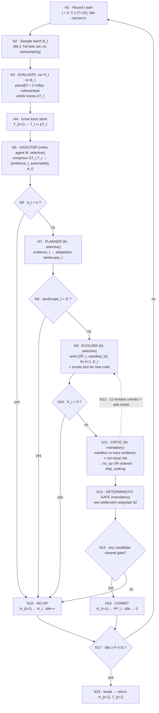
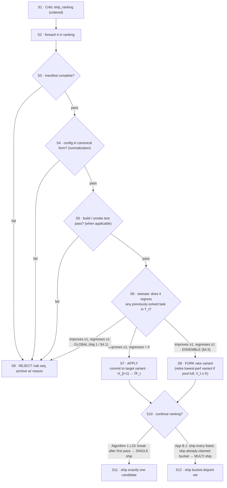

# FLOW-PAPER.md — HarnessX / AEGIS flow, reconstructed from the paper ONLY

**Sole source:** `HarnessX_Tech_Report.pdf` (43 pp, = arXiv 2606.14249). No repo code, `.md`, `runs/`, git, or web was consulted (double-blind A-side / paper-side).

**Extraction note:** text was pulled with PyMuPDF; the PDF dropped `fi`/`fl`/`ff` ligatures (e.g. "veri er" → "verifier", "con guration" → "configuration"). Verbatim quotes below **restore only these mechanical ligatures**; wording, punctuation, and symbols are otherwise exact. Page anchors (`p.N`) refer to the printed page number.

**Symbol collisions flagged up front (they matter for arbitration):**
- `a_t` = the MDP *action* / typed edit in §4.1 (p.8), **but** = a scalar *actionability* score compared to threshold α in Algorithm 1 L7–L8 (p.9). Same symbol, two meanings.
- `K` = the *variant-pool cap* in §4.5 (p.11); `K_t` = *candidates proposed per round* in Table 8 (p.29) / Algorithm 1 L15. Different quantities.
- `B_t` = per-round *adaptation batch* (Algorithm 1 L4); `B` = the co-evolution *replay buffer* (§5.1, p.12).

---

## 1. Round-level master flow (AEGIS adaptation loop, Algorithm 1, p.9)

The main loop the task asks for is the **AEGIS single-round loop**. Co-evolution (§5) is an *optional outer wrapper* that reuses the same round (noted in §7 below), not a different inner loop.

**Node count, master flow: 18** (N1–N18; the single NO-OP box N16 is shared by all four short-circuit paths).

### Node semantics (each with page anchor)

- **N1 Round start** — `for t = 0,1,…,T−1` (Algorithm 1 L3, p.9). Loop budget `T=15` "up to" rounds (§6.1, p.15; Table 8, p.29). Carries `idle` counter (Algorithm 1 L2, p.9).
- **N2 Sample batch B_t** — Algorithm 1 L4 "Sample batch B_t" (p.9). **But** §6.1 (p.15) and App A.2 (p.28) state "The full task set is evaluated every round (no subsampling)" and "The same evaluation set … is re-scored at every round." So in the reported experiments `B_t` = the *entire* fixed evaluation set (GAIA 103, ALFWorld 134, WebShop 100, τ³ 3 domains, SWE 55; Table 3, p.15). The word "batch/Sample" is nominal here (see contradiction C5).
- **N3 Evaluate** — Algorithm 1 L5 "run H_t on B_t to get traces ΔT_t" (p.9). Estimator = **pass@2**: "Each task receives two independent attempts per round (pass@2: solved if either succeeds)" (§6.1 Metrics, p.15); formalized as the standard unbiased pass@k estimator (App A.3 Eq. 6, p.29). Infrastructure-failed rollouts count as failures, not excluded (p.29). Fresh env per task, concurrency 10 (App A.5, p.29).
- **N4 Grow trace store** — Algorithm 1 L6 "T_{t+1} ← T_t ∪ ΔT_t" (p.9); §4.1 "In both cases, the trace store grows" (p.8). `T_t` is "the trace store accumulated from all previous executions" (§4.1, p.8) — cumulative, all-history.
- **N5 Digester (selective)** — Algorithm 1 L7 "(evidence_t, a_t) ← M.Digester(ΔT_t, T_t)" (p.9). Input granularity = this round's raw traces ΔT_t plus the full store T_t. Job (§4.3, p.10): "compresses each task's traces into a structured per-task summary: binary outcome, failure category (if any), implicated component identifiers, and supporting evidence excerpts" and links each task to "its history of prior outcomes and shipped edits." Scale: "A single iteration on GAIA (103 tasks, pass@2) generates ∼10M tokens of raw traces" (p.10) → "∼10K structured summaries" (§6.4, p.18). Output includes a scalar **actionability** `a_t`.
- **N6 Actionability gate `a_t < α`** — Algorithm 1 L8 (p.9). If below threshold α → short-circuit to NO-OP. Prose: Digester "may determine that no actionable failures exist (all tasks pass or signal is too sparse), terminating the round immediately" (§4.3, p.10).
- **N7 Planner (selective)** — Algorithm 1 L11 "landscape_t ← M.Planner(evidence_t)" (p.9). Builds an **adaptation landscape**: "which tasks are failing, what edits have been attempted, which components are implicated, and which edit types (prompt, tool, processor, configuration) remain untried" (§4.3, p.10). Declared "the primary defense against under-exploration" (p.10). (App B.1 planner prompt, p.30, gives the operational brief: a single `landscape.md` with YAML frontmatter `top_themes / persistent_failures / unattempted_directions`.)
- **N8 Landscape gate `landscape_t = ∅`** — Algorithm 1 L12 (p.9). Empty landscape → NO-OP: Planner "may find no viable adaptation landscape given the current evidence and edit history" (§4.3, p.10).
- **N9 Evolver (selective)** — Algorithm 1 L15 "{(H̃ᵏ_t, manifest_k)}_{k=1}^{K_t} ← M.Evolver(H_t, landscape_t)" (p.9). Produces **K_t candidate harnesses**, each a typed builder op on H_t, each carrying a **change manifest** (edited components, intended effect, tasks expected to improve/regress). "When introducing new processor code, the Evolver must also provide a smoke test confirming that the processor instantiates and runs on synthetic input without raising exceptions" (§4.3, p.10). Type-safe but not behavior-safe (p.10). K_t semantics fully treated in §4 below.
- **N10 Candidate gate `K_t = 0`** — Algorithm 1 L16 (p.9). Zero type-safe candidates → NO-OP (§4.3, p.10).
- **N11 Critic (mandatory)** — Algorithm 1 L19 "ranking ← M.Critic({(H̃ᵏ_t, manifest_k)}, evidence_t)" (p.9). Evaluates each candidate "by comparing its change manifest against trace evidence and assessing whether edits risk non-local effects through shared state or control flow" (§4.3, p.10). Defends against **reward hacking** (p.10). Returns **no_op** or an **ordered ship_ranking** (p.10). The Critic has **no shipping authority** — it recommends/ranks only (see decoupling quote §5). Per-verdict options: `accept | reject | ask-more` (App B.1 critic output, p.34).
- **N12 Revision edge (≤1)** — §4.3 (p.10): "The Critic may additionally issue a single revision request to the Evolver before returning its final verdict." / "When gaps are detected, it issues a single revision request to the Evolver. After at most one revision cycle, the Critic returns either no_op or an ordered ship_ranking." **Count = at most one revision per round; trigger = Critic detects a manifest-vs-evidence gap or non-local-effect risk.**
- **N13 Deterministic gate (mandatory)** — Algorithm 1 L21–24 (p.9); §4.3 (p.10). Sequential acceptance checks; detailed in §2 subgraph. "No edit can ship without passing through the Critic and gate" (§4.3, p.10).
- **N14 Shipped?** — Algorithm 1 L20/L25 `k⋆` found among ranking (p.9).
- **N15 Commit** — Algorithm 1 L25–26 "if k⋆ ≠ ⊥ then H_{t+1} ← H̃ᵏ*_t; idle ← 0" (p.9). Reset idle on any ship.
- **N16 No-op** — Algorithm 1 L8–10 / L12–14 / L16–18 / L27–28 (p.9): "H_{t+1} ← H_t; idle++". Shared sink of all four short-circuits plus a fully-gated-out round.
- **N17 Patience check `idle ≥ P`** — Algorithm 1 L29 "if idle ≥ P then break" (p.9). `P = 3` "early stopping after P=3 consecutive rounds without a shipped edit" (§6.1, p.15; Table 8 lists it implicitly via patience).
- **N18 Return** — Algorithm 1 L31 "return H_{t+1}, T_{t+1}" (p.9).

**Who thinks:** all four stages are ONE meta-agent (Claude Opus 4.6), not four agents. "AEGIS … comprises four stages … all driven by the same meta-agent LLM, which selectively invokes them: no external router decides stage execution; instead, the meta-agent itself determines at each stage whether sufficient signal exists to continue" (§4.3, p.9; Fig. 2 caption, p.7).

---

## 2. Settlement subgraph — the three-way decision (precise conditions)

**Caution for arbitration:** the paper never presents "APPLY / FORK / REJECT" as one unified three-way switch. Algorithm 1 (p.9) is **binary** (ship one / no-op) and **contains no FORK branch at all**. FORK exists only in §4.5 prose (p.11) for the *variant-isolation* mode. The diagram below therefore overlays two regimes (Global vs Ensemble) that the paper describes in two different places.

**Node count, settlement subgraph: 12** (S1–S12). **Combined total nodes across both diagrams: 30.**

### Settlement node semantics

- **S1 ship_ranking** — Critic's ordered output (Algorithm 1 L19, p.9; §4.3, p.10). Ordering = gate-evaluation order.
- **S2 foreach k** — Algorithm 1 L21 "foreach k in ranking do" (p.9).
- **S3–S6 the four gate layers, in sequence** — §4.3 (p.10) verbatim order: **(1) manifest completeness → (2) configuration normalization ("ensuring the candidate is in canonical form") → (3) build or smoke tests ("when applicable") → (4) the seesaw constraint (regression check on previously passing tasks)**. "The first failing check halts the sequence; passing candidates are committed and failing ones archived with their rejection reason." NOTE a *second, non-matching* enumeration exists: Fig. 6 SWE-bench panel (p.20) says "Gates check replay/novelty/structure — not pass rate" (contradiction C6).
- **S6 seesaw constraint** — the load-bearing regression test. Baseline = **previously solved tasks recorded in T_t** (§4.1, p.8; §4.3, p.10; §7.6, p.22). "improved" = a failing task now passes; "regressed" = a previously-passing task now fails, judged on the binary pass@2 signal (§6.1, p.15). See contradiction C4 on *which* baseline (all-history vs previous-round).
- **S7 APPLY** — §4.1 single-harness: `U(H̃_t, T_t, r_t)` "commits the candidate (H_{t+1} = H̃_t)" (p.8); §4.5 ensemble: "the edit improves some tasks without regressing any, in which case it is applied to its target variant" (p.11).
- **S8 FORK** (Ensemble only) — §4.5 (p.11): "it improves a subset while regressing others, in which case the system forks a new variant rather than rejecting the edit outright (retiring the lowest-performing variant if the pool is full)." Pool bound `V_t ≤ K`. **No numeric threshold ("min_fork") on how many tasks must improve/regress is given** (UNSPECIFIED U4). What the fork *inherits* is not stated (UNSPECIFIED U3).
- **S9 REJECT** — Two sources merge here: (a) any gate-layer failure → archived with reason (§4.3, p.10); (b) Global-mode regression → §4.1 "rejects it (H_{t+1} = H_t)" (p.8). Under Ensemble, the "regress-some" case is *diverted to FORK*, so the pure-REJECT trigger in Ensemble mode (e.g. regress-with-no-improvement) is not spelled out (UNSPECIFIED U13).
- **S10–S12 multi-ship divergence** — THE major internal contradiction (C1). Algorithm 1 L22–23 breaks after the first gate-passing candidate → exactly one ship. App B.1 (p.34) "ships every listed candidate in order but skips any whose bucket was already claimed" → several ships/round. Both verbatim in §5.

**Revision re-entry:** after a Critic `ask-more` and the ≤1 revision cycle, the revised candidate returns through the Critic ("After at most one revision cycle, the Critic returns … ship_ranking", §4.3 p.10) and then the gate. The exact re-entry path is only sketched (UNSPECIFIED U12).

---

## 3. Variant pool & Ensemble routing (§4.5, p.11; §6.3, p.17; §7.5, p.22)

- **Pool cap:** "maintaining up to K harness variants {H⁽¹⁾_t, …, H⁽ᵛᵗ⁾_t} (V_t ≤ K)" (§4.5, p.11). **K has no numeric value anywhere** (Table 5 row is literally "Ensemble (up to K variants)", p.17; not in Table 8) → UNSPECIFIED U1.
- **Fork inheritance:** unstated (U3). Only "forks a new variant rather than rejecting the edit outright" (p.11).
- **Retirement:** "retiring the lowest-performing variant if the pool is full" (§4.5, p.11).
- **Routing unit / estimator:** per-task. "routing each task to the variant with the highest estimated success rate on that task's cluster across prior rounds. We term this mechanism Ensemble routing" (§4.5, p.11). §6.3 restates it as "the variant with the highest prior success rate" (p.17) — drops the word "cluster" (minor variance). *How* the success rate is estimated (empirical mean? smoothing? tie-break?) is unstated → U5.
- **Cluster definition:** the word "cluster" is used repeatedly but **never defined** for the default Ensemble. §6.3 notes finer-grained variants "Domain-aware clustering, Task-level tournament" were "explored at pilot scale (30–40 tasks, ≤8 rounds)" only (p.18) → U2.
- **Per-variant seesaw scoping:** "Once multiple variants exist, the seesaw constraint is scoped per-variant: a candidate targeting variant k is tested only against tasks routed to k, so improvements to one cluster cannot regress another" (§4.5, p.11).
- **Freeze / deployment routing:** at deployment the evolved harness is "a static artifact … tasks outside the evolution set are routed to the variant with the highest overall success rate on the evolution set" (§7.5, p.22). *When the per-round routing table freezes during evolution* is not specified → U6.
- **Predicted properties (validated §6.3):** "(1) non-degrading aggregate trajectory (peak = final), (2) sustained exploration across more rounds, and (3) lower total token consumption" (§4.5, p.11; Table 5: Ensemble 87.4/87.4/Δ0.0/107.8M vs Global 49.5/73.8/−24.3/143.7M, p.17).

---

## 4. Hyperparameters & protocol (Table 8, p.29; §6.1, p.15; App A.5, p.29)

| Symbol / item | Meaning | Value | Anchor |
|---|---|---|---|
| T | rounds (budget) | up to 15 | §6.1 p.15; Alg 1 p.9 |
| P | patience (early stop: consecutive no-ship rounds) | 3 | §6.1 p.15; Alg 1 L29 p.9 |
| pass@k | evaluation estimator | pass@2, full set every round, no subsampling | §6.1 p.15; App A.3 p.29 |
| K_t | candidates proposed per round | **4** (Table 8) — but see C2 | Table 8 p.29 |
| α | Digester actionability threshold | **not given numerically** (U8) | Alg 1 L8 p.9 |
| seeds | random seeds per cell | 3 | Table 8 p.29 |
| noise threshold | ignored single-round pass-count delta | ±5% | Table 8 p.29 |
| H0 | round-0 harness | handcrafted base harness (competent, benchmark tool registry) | Table 8 p.29; App A.4 p.29 |
| meta-agent | drives all 4 stages | Claude Opus 4.6 | Table 8 p.29; §6.1 p.15 |
| task agents | run under evolved harness | Sonnet 4.6; GPT-5.4; Qwen3.5-9B | Table 8 p.29 |
| concurrency (task) | parallel task rollouts | 10 | Table 8 p.29; App A.5 p.29 |
| concurrency (meta) | meta-agent parallelism | 4, 200-step limit per role | App A.5 p.29 |
| max-steps | per-task step limit | GAIA 20, WebShop 20, ALFWorld 15, τ³ 200, SWE 200 | Table 8 p.29 |
| meta token budget | per benchmark, constant across task agents | 100M–175M total (per-bench split not tabulated, U14) | §6.1 p.15 |
| bench sizes | evaluation-set sizes | GAIA 103 (39/52/12), ALFWorld 134 (valid-unseen), WebShop 100 (fixed seed), τ³ Retail/Airline/Telecom, SWE 55 | Table 3 p.15; App A.2 p.28 |
| co-evo training | GRPO model side | 8×H100, batch 256, lr 1e−6, clip ε=0.2, no KL (β=0), 5 steps/round; buffer = 4-round sliding window (GAIA 824 = 103×2×4; WebShop 400 = 100×**1**×4) | §6.5 p.18; App A.5 p.29 |

Baselines (§6.1, p.15): **Static Harness** (published bench prompts/tools, held fixed) and **CC SDK** (single-agent evolver, one LLM session/round, replaces the four-stage pipeline; proxy for monolithic evolvers like SICA).

Co-evolution outer wrapper (§5.1, p.12), not part of the inner AEGIS diagram: 7-step iteration Rollout → Verification → Buffer insertion → **Harness evolution = AEGIS(H_t, B)** → Behavior log-probs (cache π_θold per trace via one forward pass under M_k) → Cross-harness GRPO update → Advance; FIFO buffer cap C, max version lag ⌊C/s⌋ rounds; π_ref = M0 fixed. Note step 4 says the meta-agent "proposes one discrete structural edit" (p.12) — singular, vs K_t=4 in standalone AEGIS (minor tension C9).

---

## 5. Verbatim key-sentence excerpts (arbitration bank)

**5a. K_t (candidate count).**
- Table 8 (p.29): "**K_t | candidates proposed per round | 4**"
- Evolver system prompt, App B.1 (p.31): "**You decide how many candidates (K >= 1) -- one high-value candidate beats three speculative ones, but if two genuinely different directions both have strong evidence, produce both.**"
- §4.3 Evolver (p.10): "the Evolver produces **one or more** candidate harnesses {H̃ᵏ_t}_{k=1}^{K_t}"
- Algorithm 1 L15–16 (p.9): "{(H̃ᵏ_t, manifest_k)}_{k=1}^{K_t} ← M.Evolver(H_t, landscape_t); **if K_t = 0 then** H_{t+1} ← H_t"
- Def. 2 (p.8): "each edit is a code-level artifact … **generated by the meta-agent LLM, not selected from a pre-enumerated set.**"

**5b. Multi-ship — the two conflicting statements (do NOT reconcile).**
- **Algorithm 1 L20–L27 (p.9), single-ship:** "k⋆ ← ⊥; foreach k in ranking do — **if DeterministicGate(H̃ᵏ_t, H_t, T_t) passes then k⋆ ← k; break;** — end; if k⋆ ≠ ⊥ then H_{t+1} ← H̃ᵏ*_t; idle ← 0; else H_{t+1} ← H_t; idle++"  → ships **exactly one** (breaks on first pass).
- **App B.1 (p.34), multi-ship:** "**Multi-ship: Stage 4 ships every listed candidate in order but skips any whose bucket was already claimed by an earlier-ranked ship, so bucket-disjoint candidates attacking orthogonal failure modes can ship together. Nothing ships unless decision.md parses cleanly.**"

**5c. L2 round-trip definition (Evolver build→verify→iterate, App B.1, p.31–32).**
> "For any candidate that introduces new executable code, you MUST complete this loop IN YOUR SESSION before writing the manifest: 1. Write the code to your scratch dir. 2. Verify by actually running it -- not by reasoning about it. Two levels: **- Level 1 -- unit call works: instantiate the processor/tool, drive the async hook, assert the expected state mutation happened. - Level 2 -- round-trip reaches the model: a unit call that returns does not prove the agent sees the return. Simulate the path from your code to the model's next input and assert the content survives it (provider serializer for tools; the next pipeline stage for processors).** 3. Iterate if verification fails … 4. Attach the verifying output as `capability_evidence`."
- Prompt-only exemption (p.32): "**Pure prompt-bucket candidates (no code asset) are exempt -- the counterfactual gate provides the equivalent smoke check.**"
- Critic's use of it (worked example, p.37): "the Critic verified Level-2 evidence (tool output arrives as a full string, not a truncation marker) before accepting any tools-bucket candidate."

**5d. Deterministic gate sequence (§4.3, p.10).**
> "The deterministic gate then applies acceptance checks in sequence: **manifest completeness, configuration normalization (ensuring the candidate is in canonical form), build or smoke tests (when applicable), and the seesaw constraint (regression check on previously passing tasks; Section 4.1). The first failing check halts the sequence; passing candidates are committed and failing ones archived with their rejection reason.** This decouples LLM judgment from acceptance: **regardless of the Critic's recommendation, only deterministic checks govern shipping.**"

**5e. Seesaw / regression baseline (note the two framings).**
- §4.1 (p.8), all-history: "enforcing the seesaw constraint: **the candidate must not regress any previously solved task recorded in T_t.**" (T_t = "accumulated from all previous executions", p.8)
- §7.6 (p.22): "the seesaw constraint **rejects any edit that regresses even a single previously solved task under pass@2.**"
- Planner prompt, App B.1 (p.30), previous-round framing: "regressions.md … it is the **deterministic, k-aware list of tasks whose pass-state worsened versus the previous round.**"

**5f. APPLY vs FORK (§4.5, p.11).**
> "The gating layer distinguishes two outcomes per candidate: (1) the edit improves some tasks without regressing any, in which case it is **applied to its target variant**; or (2) it improves a subset while regressing others, in which case the system **forks a new variant rather than rejecting the edit outright (retiring the lowest-performing variant if the pool is full).**"

**5g. Critic revision (§4.3, p.10).**
> "The Critic may additionally issue a **single revision request** to the Evolver before returning its final verdict." … "When gaps are detected, it issues a single revision request to the Evolver. **After at most one revision cycle,** the Critic returns either no_op or an ordered ship_ranking."

**5h. Manifest Table 9 fields (p.35–36).** See §6.

---

## 6. Manifest contract — Table 9 fields, one by one (p.35–36)

Table 9 core fields (p.35):
1. **candidate_id** — "Unique id, e.g. C-R3-01 (round 3, candidate 1)."
2. **bucket** — "Edit type: prompt, tools, config, or processor."
3. **capability_evidence** — "Verified claims that the edit mechanism actually works."
4. **file_changes** — "List of path / action / diff-summary edits."
5. **predicted_impact** — "Tasks the edit will unlock, stabilize, or put at risk: the falsifiable prediction."
6. **attribution_signature** — "Trace feature that must appear if the edit fired, e.g. a processor invocation."

`change_manifest.yaml` schema expansion (p.36) + Evolver prompt manifest shape (p.32) add sub-structure and one extra field:
- `bucket: prompt | tools | config | processor` (or a list, e.g. `[prompt, processor]`).
- `iterates_from: <prior_ship_id>` — **OPTIONAL**, only for a revert/improve (in Evolver prompt p.32; not in Table 9).
- `capability_evidence: - {type: python_package | filesystem | http_endpoint | builtin_tool | other, claim, evidence}` (evidence must be "something you OBSERVED this session: command + output snippet"; may be empty `[]` for prompt-only).
- `file_changes: - {path, action: create|modify|delete, diff_summary}`.
- `predicted_impact: { tasks_will_unlock:[…], tasks_will_stabilize:[…], tasks_at_risk:[…] }` (unlock = ALL_FAIL→≥1 pass; stabilize = PARTIAL_PASS→all pass; at_risk = ≥1 pass→might regress).
- `attribution_signature: { type: processor_invocation | tool_call | prompt_feature, tool_name, expected_min_calls (int) }`.

Manifest role (p.35): "The manifest makes every harness modification falsifiable: the Critic checks whether the next round's trace features match the mechanism and impact the manifest predicted." A concrete instance (C-R10-02) is printed at p.36–37.

---

## 7. UNSPECIFIED list (paper leaves blank — each with closest original text)

- **U1 — Variant-pool cap `K` numeric value.** Never given. Closest: "maintaining up to K harness variants … (V_t ≤ K)" (§4.5, p.11); Table 5 row "Ensemble (up to K variants)" (p.17).
- **U2 — Definition of "cluster" for the default Ensemble routing.** Word used, never defined. Closest: "routing each task to the variant with the highest estimated success rate on that task's cluster" (§4.5, p.11); alternatives "Domain-aware clustering, Task-level tournament … explored at pilot scale" (§6.3, p.18).
- **U3 — What a forked variant inherits** (parent config only? + edit? trace history? routing rows?). Closest: "the system forks a new variant rather than rejecting the edit outright" (§4.5, p.11).
- **U4 — `min_fork` / any minimum improve-or-regress count to trigger a fork vs a reject.** No threshold. Closest: "it improves a subset while regressing others" (§4.5, p.11).
- **U5 — Routing success-rate estimator mechanics** (mean vs smoothed, tie-break, cold-start). Closest: "highest estimated success rate on that task's cluster across prior rounds" (§4.5, p.11) / "highest prior success rate" (§6.3, p.17).
- **U6 — When the per-round routing table freezes during evolution.** Closest: deployment-time rule only — "tasks outside the evolution set are routed to the variant with the highest overall success rate on the evolution set" (§7.5, p.22).
- **U7 — Evolver session boundary:** whether the K_t candidates are emitted from ONE Evolver LLM session or K_t separate sessions. Closest: "You decide how many candidates (K >= 1) … produce both" (p.31) and "Per candidate, emit a manifest at …/C-R{{round}}-<NN>.md" (p.32) — reads as one session emitting NN manifests, but never stated.
- **U8 — Actionability threshold `α` numeric value.** Closest: "Input: … threshold α" (Alg 1, p.9). Table 8's "noise threshold ±5%" is a *pass-count* delta, not obviously α (relationship unstated).
- **U9 — How the Digester computes the scalar actionability `a_t`.** Closest: "(evidence_t, a_t) ← M.Digester(ΔT_t, T_t)" (Alg 1 L7, p.9); "the Digester may determine that no actionable failures exist" (§4.3, p.10).
- **U10 — Whether the gate's "build or smoke tests (when applicable)" is the SAME check as the Evolver's mandatory L1/L2 build→verify→iterate, or a re-run.** Closest: gate "build or smoke tests (when applicable)" (§4.3, p.10) vs Evolver "smoke test … instantiates and runs on synthetic input" (p.10) + L1/L2 (p.31–32).
- **U11 — The "counterfactual gate" for prompt-bucket candidates.** Named once, never defined. Closest: "Pure prompt-bucket candidates … the counterfactual gate provides the equivalent smoke check" (p.32).
- **U12 — Revision re-entry path** after `ask-more` (does the revised candidate re-run the Critic then the gate, or the gate only?). Closest: "After at most one revision cycle, the Critic returns … ship_ranking" (§4.3, p.10).
- **U13 — Under Ensemble mode, the exact condition for an outright REJECT** (as opposed to fork). Closest: only "forks … rather than rejecting the edit outright" (§4.5, p.11) — the residual reject case is not enumerated.
- **U14 — Per-benchmark meta-agent token budget split** inside the "100M–175M" range. Closest: "The meta-agent token budget varies by benchmark (100M–175M total) but is held constant across task agents within a benchmark" (§6.1, p.15).
- **U15 — Whether `B_t` is ever a strict subsample.** Algorithm 1 says "Sample batch B_t" (p.9) but §6.1 says "full task set every round, no subsampling" (p.15); the batching machinery is described but never exercised as a subsample in the reported runs.

---

## 8. Internal contradictions / self-inconsistencies found in the paper

- **C1 (MAJOR) — Single-ship vs multi-ship.** Algorithm 1 L20–27 (p.9) ships **exactly one** candidate (`break` on the first gate pass). App B.1 (p.34) says Stage 4 "ships **every** listed candidate in order but skips any whose bucket was already claimed." The formal algorithm and the operational prompt directly disagree on how many edits ship per round. (Fig. 2, p.7, also draws a single SHIP/REJECT gate, siding with Algorithm 1.)
- **C2 (MODERATE) — K_t: fixed vs free.** Table 8 (p.29) fixes "K_t = candidates proposed per round = 4"; the Evolver prompt (p.31) says "**You decide** how many candidates (K >= 1)"; Algorithm 1 (p.9) treats K_t as variable and even 0. Fixed hyperparameter, LLM-chosen, and possibly-zero coexist.
- **C3 (MODERATE) — FORK missing from the algorithm.** The "three-way settlement" is not a single object: Algorithm 1 (p.9) is strictly binary (ship one / no-op) and has **no fork path**; FORK is introduced only in §4.5 prose (p.11) and never folded back into Algorithm 1 or Fig. 2. A reader following the algorithm alone would never fork.
- **C4 (MODERATE) — Regression baseline: all-history vs previous-round.** Seesaw is defined against "any previously solved task recorded in T_t" where T_t is "accumulated from all previous executions" (§4.1, p.8) — i.e. ever-solved. But the operational regressions.md is "the … list of tasks whose pass-state worsened **versus the previous round**" (Planner prompt, p.30). Ever-solved rollback and previous-round rollback are not the same guarantee.
- **C5 (MINOR) — "Sample batch B_t" vs "full task set, no subsampling."** Algorithm 1 L4 (p.9) vs §6.1 (p.15) / App A.2 (p.28).
- **C6 (MINOR) — Gate-layer enumeration mismatch.** §4.3 (p.10): manifest completeness / config normalization / build-smoke / seesaw. Fig. 6 SWE-bench panel (p.20): "Gates check **replay/novelty/structure** — not pass rate." The two lists do not map onto each other.
- **C7 (NOTATIONAL) — `a_t` overloaded** = typed edit/action (§4.1, p.8) and = scalar actionability compared to α (Alg 1 L7–8, p.9).
- **C8 (NOTATIONAL) — `K` overloaded** = variant-pool cap (§4.5, p.11) vs `K_t` candidates/round (Table 8, p.29).
- **C9 (MINOR) — Co-evolution edit count.** §5.1 step 4 (p.12): the meta-agent "proposes **one** discrete structural edit"; standalone AEGIS proposes K_t (=4) candidates. Possibly "one shipped vs K_t proposed," but stated as "proposes."

---

*End FLOW-PAPER.md.*
